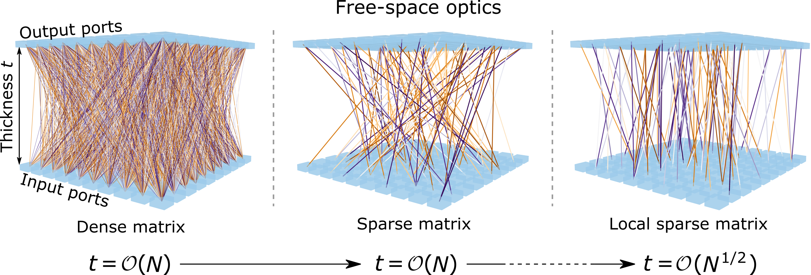
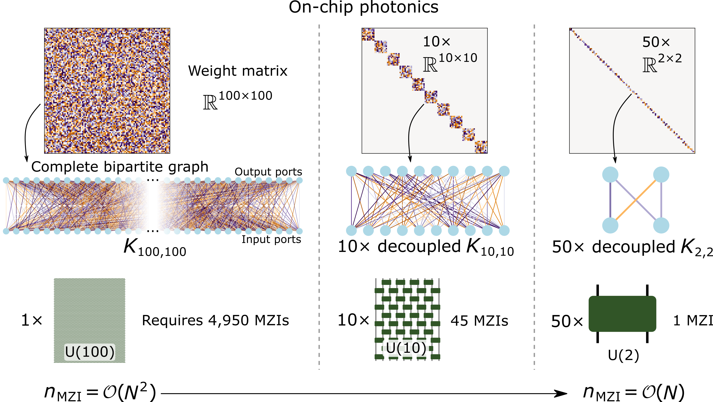

# The Spatial Complexity of Optical Computing: Toward Space-Efficient Design

> **The spatial complexity of optical computing: toward space-efficient design**  
> Yandong Li and Francesco Monticone. *Nature Communications* **16**, 8588 (2025)  
> [🔗 Link to the paper](https://www.nature.com/articles/s41467-025-63453-8)

---

## Overview

We analyze optical structures from an **algorithmic perspective**, examining how their spatial footprint scales with the dimensionality of the mathematical operations they perform, and generalize these findings into **spatial scaling laws** for free-space optics and photonic chips.

<figure>
  <p align="center">
    
  </p>
  <figcaption style="font-size:75%; max-width:600px; margin:auto; text-align:center;">
    <strong>Simplifying a generic free-space optical system.</strong>
    The thickness scaling law can be reduced from <strong>linear</strong> to <strong>square-root</strong> when the device kernel matrix is designed to exhibit a <strong><em>local sparse</em></strong> structure. 
    Visually, a <strong>sparse</strong> matrix has significantly fewer couplings than a dense one. In a <strong>local</strong> kernel matrix, all couplings are only slightly inclined from vertical, whereas nonlocal kernels lack this feature.
  </figcaption>
</figure>

<figure>
  <p align="center">
    
  </p>
  <figcaption style="font-size:75%; max-width:600px; margin:auto; text-align:center;">
    <strong>Simplifying a generic two-dimensional photonic chip</strong> based on a mesh of Mach–Zehnder interferometers (MZIs).
    The block-diagonalization, understood from a graph perspective, breaks the kernel matrix into a <strong>linear number</strong> of small, decoupled complete bipartite graphs, each of which requires a constant number of MZIs to implement. When each block is sufficiently small, block-diagonalization reduces the total number of required MZIs from <strong>quadratic</strong> to <strong>quasi-linear</strong>.
  </figcaption>
</figure>

We also develop **optics-specific neural pruning techniques** that systematically simplify optical neural networks (ONNs), fundamentally reducing their spatial scaling while **maintaining performance comparable to conventional designs**.  
A variety of **pruned, space-efficient ONNs** are demonstrated, spanning a wide range of architectures from multilayer perceptrons to edge models (**MobileNet**) and computer vision models (**Faster R-CNN**). Our theoretical and computational results reveal a **trend of diminishing returns on accuracy as ONN structure size increases**, highlighting that the ultimate limit of optical computing lies in **an optimal balance between device size and accuracy**.

---

## Repository Structure

For convenience, the different components of this work are organized into corresponding subproject folders, each of which can be run independently.  

- **`scaling_law_analysis/`** — Generate and analyze sparse, row-sparse, and local-sparse device kernels
- **`structural_bloc_diag_mlp/`** — Block-diagonal structured ONNs for compact photonic chips  
- **`structural_bloc-circ_mlp/`** — Block-circulant structured ONNs for compact photonic chips  
- **Thin free-space optics** enabled by Brain-Inspired Modular Training (BIMT)  
  For details on BIMT, see [Ziming Liu et al., *Entropy* (2024)](https://doi.org/10.3390/e26010041). Note: turn off bias for all layers
- **`structural_bloc_diag_MobileNetV2/`** — Compact photonic chip for edge AI  
  MobileNetV2 with fully connected layers pruned to the structural block-diagonal pattern  
- **`structural_bloc_diag_FasterRCNN_MobileNetV3/`** — Compact photonic chip for object detection  
  Faster R-CNN with fully connected layers pruned to the structural block-diagonal pattern  

---

## Cite this Paper

If you use this code or build upon our work, please cite:

```bibtex
@Article{Li_2025_spatial_complexity,
author={Li, Yandong and Monticone, Francesco},
title={The spatial complexity of optical computing: toward space-efficient design},
journal={Nature Communications},
year={2025},
month={Sep},
day={29},
volume={16},
number={1},
pages={8588},
issn={2041-1723},
doi={10.1038/s41467-025-63453-8}
}
```

## License

The code in this repository is released under the following license:  
[Creative Commons Attribution 4.0 International](https://creativecommons.org/licenses/by/4.0/)  
A copy of this license is given in this repository as [LICENSE.txt](https://github.com/lyd5039/The-Spatial-Complexity-of-Optical-Computing/blob/main/LICENSE.txt).
